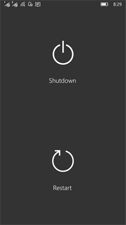

# W10MDevManShutdown

## About 
WMDevManShutdown - simplest UWP example that shows, how reboot or shutdown W10M (remotely or directly on windowsphone)))

## Screenshots

## Tech details
This small sample app based on DevManager library.

DeviceManager - a class library for UWP developers to control users'
device with advanced operation including shutdown, 
restart, GPU usage monitoring, APPX/XAP deployment, 
etc.

## ..
As is. No support. For your W10M dev education purposes.

## .
[m][e] 2020 :: 2023